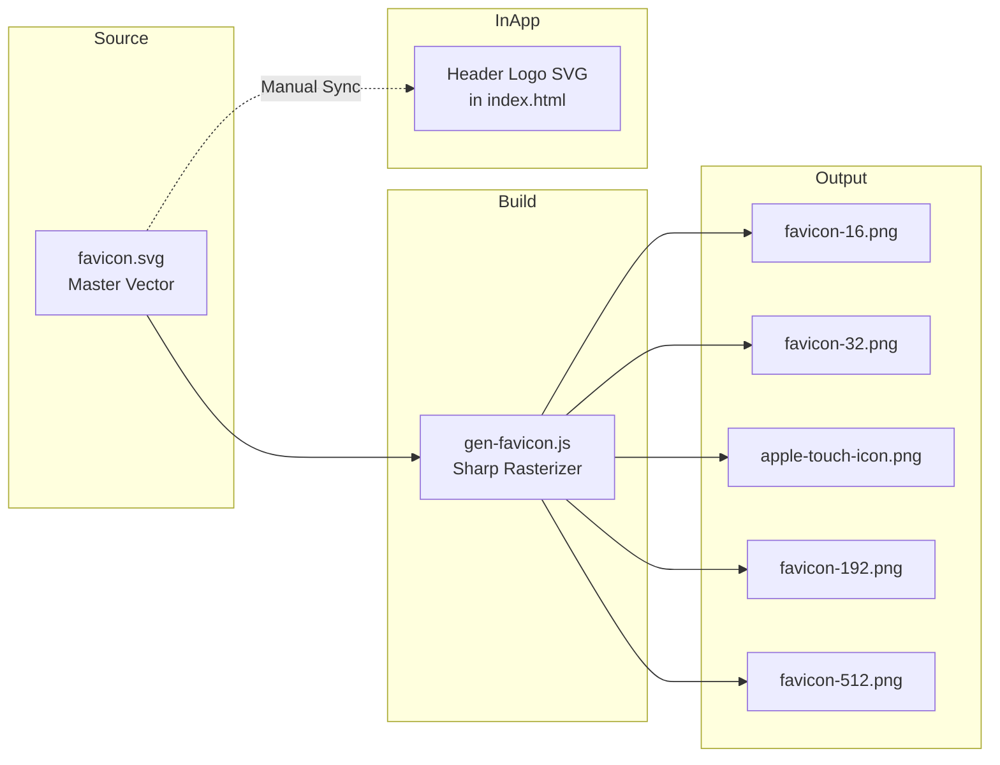

# Design Document

## Overview

This document describes the technical design for redesigning Sralify's icon assets by adding a Feather_Motif alongside the existing S_Lettermark. The feather represents "lightness," connecting visually to the meaning of "Sralify" in Khmer ("light"). This is purely a visual redesign—no new files, build tooling, or file paths are introduced.

### Design Goals

1. **Brand storytelling**: Visually represent "light" through a feather motif
2. **Brand continuity**: Preserve the recognizable S lettermark and rose gradient
3. **Legibility**: Maintain clarity at favicon sizes (16×16px)
4. **Technical simplicity**: Use existing build pipeline without modification

### Key Constraints

- All artwork must remain within the Maskable_Safe_Zone (80% centered circle)
- Feather details must not be thinner than the S_Lettermark stroke (46 SVG units)
- Combined foreground shapes limited to 2 distinct elements
- No changes to file names, paths, or manifest entries

---

## Architecture

### File Structure (Unchanged)

```
assets/
├── favicon.svg          # Master SVG source (to be redesigned)
├── favicon-16.png       # Generated 16×16
├── favicon-32.png       # Generated 32×32
├── apple-touch-icon.png # Generated 180×180
├── favicon-192.png      # Generated 192×192
└── favicon-512.png      # Generated 512×512

build/
└── gen-favicon.js       # PNG generator script (unchanged)

index.html               # Header logo SVG (to be updated)
manifest.json            # PWA manifest (unchanged)
css/sral.css             # Brand colors (unchanged)
```

### Component Relationships



The header logo is an inline SVG that must be manually synchronized with the favicon.svg design. The PNG assets are generated automatically via the build script.

---

## Components and Interfaces

### Favicon_SVG Component

The master SVG at `assets/favicon.svg` serves as the source of truth for all icon assets.

#### Current Structure

```svg
<svg viewBox="0 0 512 512">
  <defs>
    <linearGradient id="bg">          <!-- Brand_Rose_Gradient -->
    <radialGradient id="shine">       <!-- Top highlight -->
    <clipPath id="rr">                <!-- Rounded rect mask -->
  </defs>
  <g clip-path="url(#rr)">
    <rect fill="url(#bg)"/>           <!-- Background -->
    <ellipse fill="url(#shine)"/>     <!-- Shine overlay -->
    <path stroke="rgba(255,255,255,0.95)" ... />  <!-- S_Lettermark -->
  </g>
</svg>
```

#### New Structure (Proposed)

```svg
<svg viewBox="0 0 512 512">
  <defs>
    <linearGradient id="bg">          <!-- Unchanged -->
    <radialGradient id="shine">       <!-- Unchanged -->
    <clipPath id="rr">                <!-- Unchanged -->
  </defs>
  <g clip-path="url(#rr)">
    <rect fill="url(#bg)"/>           <!-- Unchanged -->
    <ellipse fill="url(#shine)"/>     <!-- Unchanged -->
    
    <!-- NEW: Feather_Motif -->
    <path d="..." fill="rgba(255,255,255,0.95)" />
    
    <!-- S_Lettermark (unchanged) -->
    <path d="..." stroke="rgba(255,255,255,0.95)" ... />
  </g>
</svg>
```

### Feather_Motif Design

The feather must be designed with these constraints:

| Constraint | Value | Rationale |
|------------|-------|-----------|
| Canvas position | Within Maskable_Safe_Zone | Ensures visibility when OS masks icon |
| Minimum stroke/fill width | ≥46 SVG units | Matches S_Lettermark stroke for legibility at 16×16 |
| Shape count | 1 feather shape | Combined with S = 2 total foreground shapes |
| Color | `rgba(255,255,255,0.95)` | Matches Foreground_Color |

#### Feather Geometry Approach

Two design approaches for the feather:

**Approach A: Simplified Feather Silhouette (Recommended)**

A single filled path representing a feather outline with:
- Tapered quill shaft (thick at base, thin at tip)
- Curved vane shape (wider at top, narrowing to tip)
- No internal barb detail lines

This approach prioritizes legibility at 16×16px and meets Requirement 2.5 (max 2 foreground shapes).

**Approach B: Feather with Barb Details**

A feather shape with internal vane barb lines, plus a simplified fallback for small sizes. More complex but may lose detail at small sizes.

**Recommendation**: Use Approach A. At 16×16px (~3px stroke equivalent), individual barbs would merge into an unrecognizable mass. A clean silhouette is more legible.

#### Positioning Considerations

The feather should be positioned to:
1. Not overlap or obscure the S_Lettermark
2. Create visual balance within the rounded square
3. Remain within the 80% safe zone (centered circle of radius 204.8 units)

Possible arrangements:
- **Corner placement**: Feather in upper-left, S centered-right
- **Diagonal composition**: Feather angled, S overlapping slightly
- **Horizontal split**: Feather left, S right

### Header_Logo Component

The inline SVG in `index.html` header (within `.logo` container) must reflect the same design.

#### Current Implementation

```html
<div class="logo" aria-hidden="true">
  <svg viewBox="0 0 24 24" fill="none" stroke="white"
       stroke-width="2.2" stroke-linecap="round" stroke-linejoin="round"
       style="width:1.25rem;height:1.25rem">
    <path d="M4 14.5V18a2 2 0 0 0 2 2h12a2 2 0 0 0 2-2v-3.5"/>
    <path d="M8 11l4 4 4-4"/>
    <path d="M12 3v12"/>
  </svg>
</div>
```

**Note**: The current header SVG is a download icon, NOT the S_Lettermark. This is an inconsistency that should be corrected as part of this redesign.

#### New Implementation (Proposed)

```html
<div class="logo" aria-hidden="true">
  <svg viewBox="0 0 24 24" fill="none" stroke="rgba(255,255,255,0.95)"
       stroke-width="1.8" stroke-linecap="round" stroke-linejoin="round"
       style="width:1.5rem;height:1.5rem">
    <!-- Feather_Motif (scaled to 24×24 viewBox) -->
    <path d="..." />
    <!-- S_Lettermark (scaled to 24×24 viewBox) -->
    <path d="..." />
  </svg>
</div>
```

The viewBox scaling from 512×512 to 24×24 requires:
- Stroke width: 46 ÷ 21.33 ≈ 2.16 → 2.2 (rounded)
- Path coordinates: Divide by 21.33

### Icon_Generator Component

The build script at `build/gen-favicon.js` requires no changes. It:
1. Reads `assets/favicon.svg` as a buffer
2. Uses `sharp` to resize to each target dimension
3. Outputs PNG with compression level 9

The script already handles any valid SVG content, so as long as the redesigned `favicon.svg` is well-formed, the generator will produce correct output.

---

## Data Models

### SVG Coordinate System

```
┌─────────────────────────────────────┐
│ (0,0)                        (512,0)│
│                                     │
│     ┌───────────────────────┐       │
│     │  Maskable_Safe_Zone   │       │
│     │    (80% = 410×410)    │       │
│     │                       │       │
│     │         ●             │       │
│     │      (256,256)        │       │
│     │        center         │       │
│     │                       │       │
│     └───────────────────────┘       │
│                                     │
│(0,512)                       (512,512)
└─────────────────────────────────────┘

Rounded rect corners: rx=112, ry=112
Safe zone radius: 204.8 (centered at 256,256)
```

### Color Palette

| Token | Value | Usage |
|-------|-------|-------|
| Brand_Rose_Gradient Stop 1 | `#f43f5e` | Gradient start (rose-500) |
| Brand_Rose_Gradient Stop 2 | `#be123c` | Gradient end (rose-600) |
| Foreground_Color | `rgba(255,255,255,0.95)` | S_Lettermark & Feather_Motif |
| Theme_Color | `#f43f5e` | manifest.json theme_color |

### Icon Size Requirements

| Size | Use Case | Min Detail Width |
|------|----------|------------------|
| 16×16 | Browser favicon | 1.5px effective |
| 32×32 | Browser favicon (retina) | 3px effective |
| 180×180 | Apple touch icon | 8px effective |
| 192×192 | Android Chrome | 8.5px effective |
| 512×512 | PWA splash | 23px effective |

At 512×512, the S_Lettermark stroke is 46px. When scaled to 16×16:
- 46 × (16/512) = 1.4375px effective stroke width

This is near the minimum for visual clarity, which is why Requirement 2.2 mandates that feather details not be thinner than the S_Lettermark stroke.

---

## Correctness Properties

This feature is **NOT suitable for property-based testing** because it involves visual design work rather than computational logic.

### Assessment

Property-based testing is appropriate for pure functions with clear input/output behavior where universal properties can be verified across a wide input space. This feature does not meet those criteria:

1. **Visual design work**: The requirements involve aesthetic judgment (legibility, distinguishable shapes, visual balance) that cannot be programmatically verified
2. **No pure functions**: There are no input→output transformations to test—the work is creating SVG artwork
3. **Rasterization is external**: The `sharp` library handles PNG generation—testing its behavior is the library author's responsibility
4. **Subjective criteria**: Acceptance criteria like "distinguishable" and "legible" require human visual inspection
5. **Static assets**: The output is a set of fixed image files, not a running system with varying inputs

### Alternative Verification Approaches

Instead of property-based tests, this feature uses:

- **Manual visual inspection**: Designer verifies each PNG output at actual size
- **Snapshot testing (optional)**: Compare generated PNGs against approved baseline images
- **Visual regression tools (optional)**: Use Percy, Chromatic, or similar for automated visual diff detection
- **Review checklist**: Systematic verification against the visual testing criteria in the Testing Strategy section

---

## Error Handling

### SVG Validation

The `gen-favicon.js` script handles malformed SVG by exiting with an error:

```javascript
generate().catch(err => { console.error(err); process.exit(1); });
```

**Design consideration**: The redesigned SVG must be well-formed:
- All paths must have valid `d` attributes
- All gradient references must resolve
- No unclosed elements
- Valid XML syntax

### Visual Testing Checklist

Since automated testing is not applicable for visual design, manual verification is required:

1. **16×16 favicon**: S_Lettermark distinguishable, feather silhouette visible (if simplified)
2. **32×32 favicon**: Both elements clearly visible
3. **180×180 touch icon**: Full detail visible
4. **Header logo**: Matches favicon design at 2.5rem container size
5. **Dark mode**: Logo visible against `.logo` background (rose-500)
6. **Masked icon**: Both elements visible within safe zone when circular mask applied

---

## Testing Strategy

### Visual Verification (Manual)

This feature requires visual inspection rather than automated testing:

1. **Rasterization check**: Run `node build/gen-favicon.js` and visually inspect each PNG output
2. **Browser tab test**: Load the app and verify favicon appears correctly in browser tab
3. **Mobile home screen test**: Install PWA and verify icon on home screen
4. **Header logo test**: Verify inline SVG matches favicon design

### Test Cases

| Test ID | Description | Expected Result |
|---------|-------------|-----------------|
| TC-1 | Generate PNGs from redesigned SVG | All 5 PNGs created without error |
| TC-2 | View favicon-16.png at 100% | S_Lettermark distinguishable |
| TC-3 | View favicon-32.png at 100% | Both elements clearly visible |
| TC-4 | Load app in browser | Favicon and header logo consistent |
| TC-5 | Apply circular mask to favicon | Both elements within safe zone |

### Why Property-Based Testing Does Not Apply

This feature is NOT suitable for property-based testing because:

1. **Visual design work**: The requirements involve aesthetic judgment (legibility, distinguishable shapes) that cannot be programmatically verified
2. **No pure functions**: There are no input→output transformations to test
3. **Rasterization is external**: The `sharp` library handles PNG generation—testing its behavior is the library author's responsibility
4. **Subjective criteria**: "Distinguishable" and "legible" require human visual inspection

Alternative verification approaches:
- **Snapshot testing**: Compare generated PNGs against approved baseline images
- **Visual regression testing**: Use tools like Percy or Chromatic for automated visual diff detection
- **Manual review checklist**: Designer approval at each size

---

## Implementation Notes

### Feather Design Process

1. Create feather path at 512×512 scale
2. Ensure minimum stroke/fill width ≥46 units
3. Position within safe zone (center 410×410 area)
4. Test by generating PNGs and inspecting at actual size
5. Iterate on design if 16×16 legibility is insufficient

### Header Logo Synchronization

The header logo must be manually updated to match the favicon. To keep them in sync:

1. Scale the favicon SVG paths from 512×512 to 24×24 viewBox
2. Adjust stroke-width proportionally (46 → ~2.2)
3. Copy path data to inline SVG in `index.html`
4. Test in both light and dark modes

### Build Process

```bash
# After modifying favicon.svg:
node build/gen-favicon.js

# Verify outputs:
ls -la assets/favicon*.png assets/apple-touch-icon.png
```

---

## Summary

This design preserves Sralify's existing technical infrastructure while adding visual brand storytelling through a feather motif. The key challenges are:

1. **Legibility at 16×16**: Simplified feather silhouette required
2. **Visual balance**: Positioning feather and S without overlap
3. **Manual synchronization**: Header logo must stay in sync with favicon

The implementation requires no code changes—only SVG artwork modification and PNG regeneration via the existing build script.
