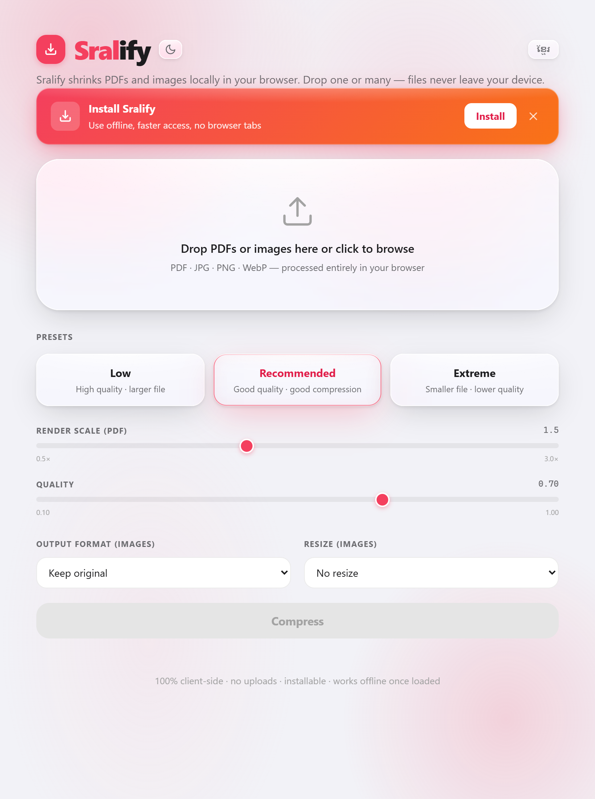
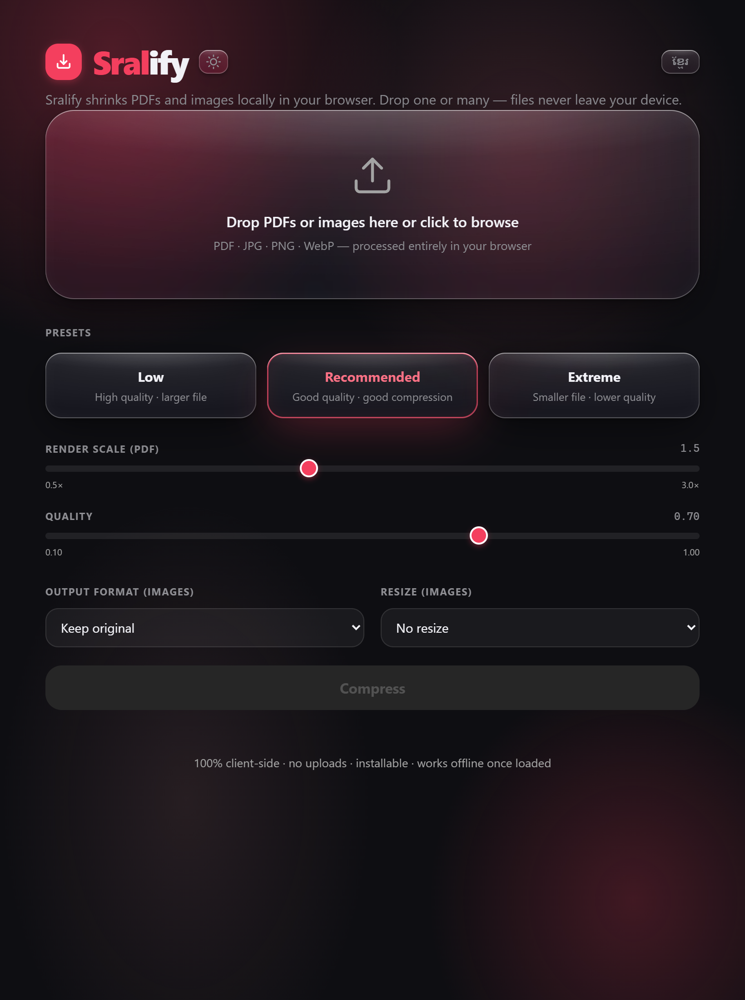

<div align="center">


# **Sralify**

### Make files **light**

**Sral** (ស្រាល) means *light* in Khmer  
Compress PDFs and images **locally in your browser**  
No uploads • No accounts • No limits • 100% private

[](https://vercel.com/new/clone?repository-url=https%3A%2F%2Fgithub.com%2Fim4tta%2FSralify)
[](https://app.netlify.com/start/deploy?repository=https://github.com/im4tta/Sralify)
[](LICENSE)

[**✨ Live Demo**](https://sralify.vercel.app) • [📦 Install as PWA](#-installable-pwa)

</div>

---

## 📸 See it in action

<p align="center">
  
  
</p>

<div align="center">

*Glassmorphism UI • Animated gradients • Before/After preview slider • Smart compression suggestions*

</div>

---

## 🔥 Why Sralify is different

Most online compressors:
- ❌ Upload your private files to someone else's server
- ❌ Have file-size limits (usually 10-50 MB max)
- ❌ Require signup, show ads, or throttle you
- ❌ Charge for bulk processing

**Sralify:**
- ✅ **100% client-side** — files never leave your device
- ✅ **No limits** — compress 1 GB+ of files if you want
- ✅ **Zero tracking** — no analytics, no cookies, no surveillance
- ✅ **Free forever** — MIT-licensed, open-source
- ✅ **Works offline** — installable PWA with full offline support
- ✅ **Smart AI suggestions** — analyzes your images and suggests the best preset

---

## ✨ Features

### Core compression
- 🗂️ **Universal drop zone** — PDFs + images (JPG/PNG/WebP) auto-detected
- 📚 **Batch mode** — drop dozens of files at once, compress all
- 🎚️ **Presets + manual control** — Low/Recommended/Extreme presets, or fine-tune scale/quality/format
- 🖼️ **Image conversion** — export as WebP (smallest), JPEG, PNG (lossless), or keep original
- 📐 **Smart resize** — cap longest edge (800px–1920px) without distortion

### Modern UX (new in v3)
- 🔮 **Glassmorphism UI** — frosted-glass cards with backdrop blur + animated gradients
- ⚖️ **Before/After slider** — drag to compare original vs compressed quality before downloading
- 🧠 **AI-powered suggestions** — analyzes pixel data and suggests optimal preset per file
- 🎨 **Zero-dependency image processing** — pure Canvas API, no heavy libraries

### Pro features
- 📊 **Live savings tracker** — see total MB saved + percent reduction per file
- 📣 **Shareable stat cards** — generate a PNG showing your savings
- 🔄 **Re-compress without re-upload** — tweak settings and reprocess without dropping files again
- 💾 **Download all as ZIP** — auto-bundles compressed files
- 📲 **Installable PWA** — add to home screen, works fully offline
- 🌗 **Dark mode** — follows OS preference
- 🌐 **Bilingual** — English + Khmer (ខ្មែរ) UI

---

## 🚀 How it works

### PDFs
Uses [PDF.js](https://mozilla.github.io/pdf.js/) to render each page to a canvas, then [jsPDF](https://github.com/parallax/jsPDF) to rebuild a new PDF with JPEG-encoded pages.

**Best for:** Scanned documents, image-heavy PDFs (60–90% size reduction typical)  
**Trade-off:** Text becomes images (no longer selectable)  
**Tip:** Use **Low** preset if you need maximum quality/sharpness

### Images
Re-encodes using the browser's native Canvas API — **no library overhead** (zero extra KB downloaded).

**Best for:** Photos, screenshots, graphics  
**Options:** Convert to WebP (smallest), resize, adjust quality  
**Lossless mode:** PNG output ignores quality slider

---

## 🎯 Quick start

### Option 1: Use the live site
Just visit **[sralify.app](https://sralify.app)** — no installation needed.

### Option 2: Deploy your own

One-click deploy to your own domain (free hosting):

| Platform | Deploy |
|----------|--------|
| **Vercel** | [](https://vercel.com/new/clone?repository-url=https%3A%2F%2Fgithub.com%2Fim4tta%2FSralify) |
| **Netlify** | [](https://app.netlify.com/start/deploy?repository=https://github.com/im4tta/Sralify) |
| **Cloudflare Pages** | [Deploy now](https://deploy.workers.cloudflare.com/?url=https://github.com/im4tta/Sralify) |
| **GitHub Pages** | Just fork this repo, enable Pages in Settings → Pages |

Or host the static files anywhere — S3, your own server — **no backend required**.

### Option 3: Run locally

No build step needed — just open `index.html` or serve locally:

```bash
# Python
python3 -m http.server 8000

# Node.js
npx serve .

# Any static server works
```

Then visit `http://localhost:8000`

---

## 📦 Project structure

```
Sralify/
├── index.html                 # Main UI (semantic HTML, no framework)
├── manifest.json              # PWA manifest (installable app)
├── sw.js                      # Service worker (offline support)
│
├── css/
│   └── sral.css               # Complete styles (~7KB gzipped, no Tailwind!)
│
├── js/                        # Pure ES modules, zero dependencies
│   ├── app.js                 # Main logic (state, UI, queue management)
│   ├── i18n.js                # Translations (EN/KM)
│   ├── lazy-loader.js         # On-demand CDN library loading
│   ├── pdf-compressor.js      # PDF pipeline (PDF.js + jsPDF)
│   ├── image-compressor.js    # Canvas-based image compression
│   └── share-card.js          # PNG stat card generator
│
├── locales/
│   ├── en.json                # English translations
│   └── km.json                # Khmer (ខ្មែរ) translations
│
├── assets/
│   ├── favicon.svg            # Modern SVG favicon
│   ├── favicon-{16,32,192,512}.png
│   ├── apple-touch-icon.png
│   ├── screenshot.png         # Light mode preview
│   └── screenshot-dark.png    # Dark mode preview
│
├── build/
│   └── gen-favicon.js         # PNG favicon generator (run: node build/gen-favicon.js)
│
├── README.md                  # You are here
├── LICENSE                    # MIT
├── ACKNOWLEDGEMENTS.md        # Open-source credits
├── package.json               # Minimal metadata (no build step)
└── vercel.json                # Static deploy config
```

### Key architectural decisions

- **Zero framework** — Vanilla JS modules, semantic HTML, hand-crafted CSS
- **No build step** — Ships raw ES modules, no bundler required
- **Lazy-loaded CDN libraries** — PDF.js/jsPDF/JSZip only load when actually needed
- **CSS variables for theming** — Dark mode is a single class toggle
- **localStorage for persistence** — Settings + language preference survive refreshes

---

## 🌐 Browser support

Works in any modern browser (Chrome, Firefox, Safari, Edge — last 2 versions).

**Note:** Large PDFs (100+ pages) are memory-intensive — desktop recommended for heavy workloads.

---

## 🎨 Customization

### Change brand colors

Edit `css/sral.css`:

```css
:root {
  --rose-500: #f43f5e;  /* Primary brand color */
  --emerald-500: #10b981; /* Success/savings color */
  /* ... */
}
```

### Add a new language

1. Create `locales/xx.json` with translations (copy `en.json` as template)
2. Add language toggle in `js/app.js` (search for `'km'` to see pattern)
3. Update `<html lang="...">` attribute in `index.html`

### Regenerate favicons

```bash
node build/gen-favicon.js
```

This generates all sizes from the script (no Photoshop needed).

---

## 🤝 Contributing

PRs welcome! Ideas:

- [ ] **"Keep text selectable" mode** — use `pdf-lib` to recompress embedded images without rasterizing pages
- [ ] **Office document support** — docx/pptx/xlsx are just ZIP containers; extract and recompress images inside
- [ ] **Drag-to-reorder queue** — rearrange files before compressing
- [ ] **WebAssembly Ghostscript** — true PDF-level optimization
- [ ] **AVIF output** — even smaller than WebP for images
- [ ] **History/undo** — store last 10 files in IndexedDB for recovery
- [ ] **Shareable links (P2P)** — WebRTC data channels for direct browser-to-browser file transfer

### Development workflow

1. Fork this repo
2. Make changes (HTML/CSS/JS — no build needed!)
3. Test locally: `npx serve .`
4. Submit PR

---

## 💡 Why I built this

I got tired of:
- Uploading private documents to random compressor sites
- Hitting "5 MB max" file-size walls
- Seeing ads or being asked to sign up
- Worrying about what happens to my files after upload

So I built Sralify — a tool I'd actually trust with my own files. If it's useful to you too, that's awesome. Star the repo, share it, fork it, whatever. It's free and always will be.

---

## 📜 License

[MIT](LICENSE) © 2026 im4tta

You can use this code for anything — personal, commercial, educational. Attribution appreciated but not required.

---

## 🙏 Acknowledgements

This project stands on the shoulders of open-source giants:

- [PDF.js](https://mozilla.github.io/pdf.js/) (Mozilla) — PDF rendering engine
- [jsPDF](https://github.com/parallax/jsPDF) — PDF generation library
- [JSZip](https://stuk.github.io/jszip/) — ZIP file creation

See [ACKNOWLEDGEMENTS.md](ACKNOWLEDGEMENTS.md) for the full list.

---

<div align="center">

**Made with ❤️ for privacy-conscious humans**

[⭐ Star on GitHub](https://github.com/im4tta/Sralify) • [🐛 Report Bug](https://github.com/im4tta/Sralify/issues) • [💡 Request Feature](https://github.com/im4tta/Sralify/issues)

</div>
